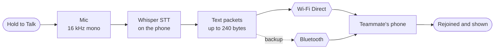
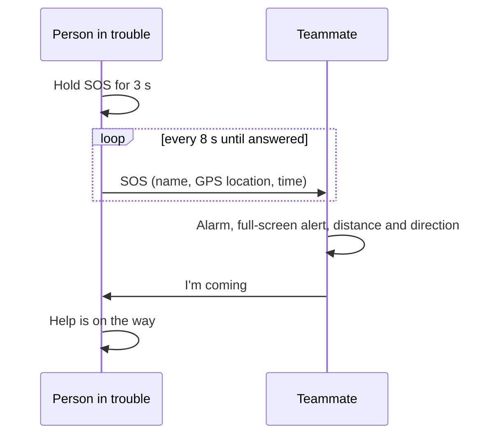

<div align="center">


<h1>iTantra</h1>

<p><b>Offline, multilingual push-to-talk for emergency teams.</b><br/>
Speak into one phone. The words become text on the device and reach your teammate over<br/>
Wi-Fi Direct or Bluetooth. No internet, no SIM, no server.</p>

<br/>


<br/><br/>

<b>Smart India Hackathon 2026</b> &nbsp;·&nbsp; Problem Statement <b>26173</b> &nbsp;·&nbsp; Team <b>Rogue Devs</b>

<br/><br/>

<a href="#features">Features</a> &nbsp;•&nbsp;
<a href="#how-it-works">How it works</a> &nbsp;•&nbsp;
<a href="#tech-stack">Tech stack</a> &nbsp;•&nbsp;
<a href="#performance">Performance</a> &nbsp;•&nbsp;
<a href="#getting-started">Getting started</a> &nbsp;•&nbsp;
<a href="#project-structure">Project structure</a>

</div>

<br/>

---

<br/>

##  &nbsp;About

When towers and internet go down in a disaster, voice is what rescue teams need most, and raw
voice needs a network. **iTantra** keeps teams talking with nothing but the phones in their
pockets:

- Speech is turned into **text on the phone**, so only a few bytes travel instead of audio.
- Phones connect **directly to each other**, over Wi-Fi Direct first and Bluetooth as backup.
- An **SOS** carries who, where and when, and keeps going until a teammate answers.

<br/>

---

<br/>

<a id="features"></a>


<br/>

<table>
<tr>
<td width="50%" valign="top">

<h3>Hold to Talk</h3>
Press, speak, release. Offline speech-to-text turns your voice into text in <b>English or
Hindi</b>, shown on screen with how long it took.
</td>
<td width="50%" valign="top">

<h3>Sent with delivery receipts</h3>
Every message goes to the paired teammate automatically, with live status:
<i>Sending → Delivered</i>, or a clear reason if it can't.
</td>
</tr>
<tr>
<td width="50%" valign="top">

<h3>Pair with a 4-digit code</h3>
One phone taps <b>Show my code</b>, the other <b>Enter a code</b>. The code finds the phone and
sets up the link. Nothing else to configure.
</td>
<td width="50%" valign="top">

<h3>Self-healing offline link</h3>
Wi-Fi Direct first, Bluetooth as backup. If Wi-Fi drops, messages switch to Bluetooth and move
back by themselves. Every message is acknowledged and re-sent if lost.
</td>
</tr>
<tr>
<td width="50%" valign="top">

<h3>SOS with location</h3>
Hold the SOS button for 3 seconds. Your name and GPS location go to your teammate and keep
going until they answer <b>"I'm coming"</b>.
</td>
<td width="50%" valign="top">

<h3>Loud alarm for the teammate</h3>
An incoming SOS rings on the alarm channel at full volume with vibration, opens a full-screen
alert, and shows how far away and in which direction the sender is.
</td>
</tr>
<tr>
<td width="50%" valign="top">

<h3>Truly offline</h3>
No internet, SIM, cloud or Google Play Services. A build check fails if an HTTP client or a
closed Google SDK is ever added.
</td>
<td width="50%" valign="top">

<h3>Profile and settings</h3>
Name and preferred languages, speech language, offline-link switch and emergency numbers, all
saved on the phone. A live notification shows the link status.
</td>
</tr>
</table>

<br/>

---

<br/>

<a id="how-it-works"></a>


<br/>

### Voice message



<br/>

### SOS



<br/>

---

<br/>

<a id="tech-stack"></a>


<br/>

| | Technology | Used for |
|:---:|---|---|
|  | **Kotlin 2.1** | The whole app |
|  | **Jetpack Compose + Material 3** | UI |
|  | **Android SDK 36** (min 26) | Platform, foreground service, notifications |
|  | **ONNX Runtime** | Running the speech models on the phone |
|  | **Whisper-tiny, fine-tuned per language** (INT8, ~42 MB each) | Speech-to-text in English and Hindi |
|  | **Wi-Fi Direct** | Main phone-to-phone link |
|  | **Bluetooth RFCOMM** | Pairing and backup link |
|  | **Android LocationManager** | GPS for SOS, without Play Services |
|  | **Hilt** | Dependency injection |
|  | **Kotlin Coroutines + Flow** | Link engine, recording, UI state |
|  | **DataStore + kotlinx.serialization** | Saved profile, settings, emergency numbers |
|  | **Gradle 8.11 + AGP 8.9** | Build, offline-only dependency check |

<br/>

---

<br/>

<a id="performance"></a>


Speech-to-text measured on a **Samsung Galaxy A54** (Exynos 1380, 8 cores), 4-second sentences:

<br/>

| Language | Time to text | Result |
|---|:---:|:---:|
| English | **~0.8 s** | Exact |
| Hindi | **~1.7 s** | Exact |

<br/>

Link tested between two phones (Galaxy A54 and Moto G Stylus 5G 2024): pairing, messages both
ways, switch to Bluetooth when Wi-Fi drops, and back to Wi-Fi when it returns.

<br/>

---

<br/>

<a id="getting-started"></a>


<br/>

### Requirements

| Tool | Version |
|---|---|
| Android Studio | Meerkat 2024.3.1 or newer |
| JDK | 17 (bundled with Android Studio) |
| Android SDK | API 36 |
| Test phones | Android 10 or newer |

<br/>

### Build and install

```bash
git clone https://github.com/MOHAMMED-NOUMAN/RogueDevs.git
cd RogueDevs
./gradlew assembleDebug        # Windows: .\gradlew.bat assembleDebug
```

The APK is written to **`app/build/outputs/apk/debug/itantra-debug.apk`**. Install it with
`./gradlew installDebug` (phone connected, USB debugging on) or copy it to the phone.

In Android Studio: **File → Open**, wait for Gradle sync, then **Run ▶**. Decline any offer to
upgrade the Android Gradle Plugin; versions are pinned.

<br/>

### Try it on two phones

| Step | Phone A | Phone B |
|:---:|---|---|
| **1** | Install, sign up with a name and language | Same |
| **2** | **Pair** tab → **Show my code** | **Pair** tab → **Enter a code**, type it |
| **3** | **Home** → hold the mic, speak, release | The message appears on **Home** |
| **4** | **SOS** → hold for 3 seconds | Alarm rings → **I'm coming** |

The speech language is set in **Settings → Speech Language**.

<br/>

### Developer commands

| Command | What it does |
|---|---|
| `./gradlew testDebugUnitTest` | Unit tests: link engine, message splitting, SOS packets |
| `./gradlew assembleTransportDebug` | Debug APK with the two-phone link test screen |
| `adb shell am instrument -w -e class com.itantra.stt.SttBenchmarkTest com.itantra.app.test/androidx.test.runner.AndroidJUnitRunner` | Speech-to-text speed and accuracy on a phone; report in `adb logcat -s SttBenchmark` |

The speech benchmark uses `am instrument` instead of `connectedAndroidTest`, which would uninstall
the app and its saved profile afterwards.

<br/>

---

<br/>

<a id="project-structure"></a>


```text
app/src/main/java/com/itantra/
├── app/
│   ├── core/
│   │   ├── audio/          Push-to-talk recording
│   │   ├── location/       GPS position for SOS
│   │   ├── messaging/      Message format, splitting, send and receive
│   │   ├── ml/             Speech-to-text service
│   │   ├── permissions/    Runtime permissions for the link
│   │   ├── prefs/          Saved profile, speech language, emergency numbers
│   │   ├── sos/            SOS sending, alarm and alert
│   │   └── transport/      Pairing, Wi-Fi Direct, Bluetooth, link service
│   ├── feature/
│   │   ├── communication/  Pair screen, push-to-talk state
│   │   ├── emergency/      SOS screen, incoming SOS alert
│   │   ├── home/           Home screen, bottom navigation
│   │   ├── pairing/        Pairing state and prompts
│   │   ├── settings/       Settings screen
│   │   └── signup/         Signup, language picker
│   ├── navigation/         Signup → Home
│   └── ui/                 Theme, logo
└── stt/                    Whisper ONNX inference and benchmark

app/src/main/assets/        Speech models (whisper-en, whisper-hi) and benchmark clips
app/src/transportDebug/     Two-phone link test screen
backlog/                    Team map and organisation feed screens, kept for later
docs/assets/                README images
```

<br/>

<details>
<summary><b>Toolchain versions</b> (pinned; change only after team discussion)</summary>

<br/>

| Tool | Version |
|---|---|
| Android Gradle Plugin | 8.9.1 |
| Gradle | 8.11.1 |
| Kotlin | 2.1.21 |
| KSP | 2.1.21-2.0.2 |
| Compose BOM | 2025.09.00 |
| Min SDK / Target SDK | 26 / 36 |

</details>

<br/>

---

<br/>

##  &nbsp;Contributing

See **[CONTRIBUTION.md](CONTRIBUTION.md)**. Keep changes focused on the iTantra requirements: no
unnecessary dependencies, abstractions or duplicate implementations.

<br/>

##  &nbsp;License

See **[LICENSE](LICENSE)**.

<br/>

<div align="center">


<sub>Built by <b>Team Rogue Devs</b> for Smart India Hackathon 2026</sub>

</div>
